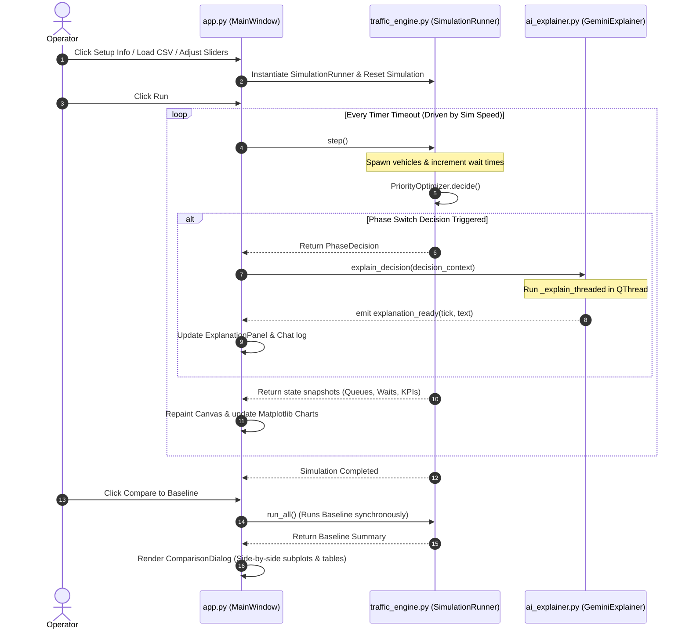

# Smart Traffic Signal Controller — Application Flow & Architecture Document

This document provides a comprehensive analysis of the **Smart Traffic Signal Controller** codebase. It outlines the project's purpose, details the class structure and call flows, documents **every single function and method**, and traces the step-by-step user interactions.

---

## 1. Project Purpose & Objectives

The primary goal of the Smart Traffic Signal Controller is to optimize traffic flow at a 4-way intersection (North, South, East, West) dynamically in real-time. 

Traditional signal controllers operate on rigid, fixed schedules which do not adapt to actual vehicle demand, leading to unnecessary delays and idle vehicles. This project demonstrates how:
1. A state-based **Priority Optimizer (AI)** can reduce vehicle wait times stochastically by computing "need scores" for lanes using queue length, wait times, and emergency vehicle flags.
2. **Generative AI (Gemini API)** can provide natural language explanations of signal decisions and act as an operator assistant via an interactive chat terminal.
3. An **animated top-down GUI** can make complex scheduler decisions visually transparent, complying fully with the UI and explainability criteria required in the lab project guide.

---

## 2. Architecture & Data Flow Diagram

The application is structured using a decoupled Model-View-Controller (MVC) pattern, where the simulation engine has no direct dependency on the PyQt5 UI thread, communicating instead via Qt Signals and callback hooks.

---

## 3. Comprehensive Module and Function Directory

---

### Module 1: `traffic_engine.py` (Simulation & Logic)

This module handles the mathematical formulation of the intersection state, vehicle generation, priority scheduling, baseline simulation, and metrics collection.

#### Data Classes & Enums
- **`Vehicle`**
  - **Type:** Dataclass
  - **Purpose:** Represents a single vehicle in the queueing network.
  - **Fields:** `id` (int), `lane` (str), `arrival_tick` (int), `is_emergency` (bool), `wait_time` (float), `cleared` (bool), `cleared_tick` (int).
- **`SignalPhase`**
  - **Type:** Enum
  - **Purpose:** Defines the active phase configurations.
  - **Members:** `NORTH_SOUTH_GREEN`, `EAST_WEST_GREEN`, `YELLOW`, `ALL_RED`, `PEDESTRIAN`.
- **`PhaseDecision`**
  - **Type:** Dataclass
  - **Purpose:** Encapsulates a controller decision payload.
  - **Fields:** `tick` (int), `chosen_phase` (SignalPhase), `need_scores` (dict), `queue_lengths` (dict), `avg_wait_times` (dict), `emergency_flags` (dict), `reason` (str).

#### Class: `Lane`
Manages the queue structure for a single direction of the intersection.
- **`__init__(self, name: str)`**: Initializes the lane with a deque queue, empty list for cleared vehicles, and counters.
- **`queue_length` (property)**: Returns the current queue length.
- **`has_emergency` (property)**: Checks if any vehicle in the lane is flagged as an emergency vehicle.
- **`avg_wait_time` (property)**: Calculates the average wait time of all vehicles currently in the queue.
- **`add_vehicle(self, vehicle: Vehicle)`**: Appends a vehicle to the queue and increments arrival counters.
- **`clear_vehicles(self, count: int, current_tick: int) -> list[Vehicle]`**: Pops up to `count` vehicles from the front of the queue, marks them as cleared, and appends them to cleared vehicle records.
- **`tick_wait(self)`**: Increments wait times of all queued vehicles by $1.0$ tick.
- **`reset(self)`**: Clears queues and resets counts.

#### Class: `Intersection`
Encapsulates all four `Lane` objects and the current phase state.
- **`__init__(self)`**: Wires four `Lane` instances (North, South, East, West) and sets the initial green phase.
- **`get_green_lanes(self) -> list[str]`**: Returns lane keys which have a green light during the active phase.
- **`get_queue_snapshot(self) -> dict`**: Returns a dictionary mapping directions to current queue lengths.
- **`get_wait_snapshot(self) -> dict`**: Returns a dictionary mapping directions to rounded average wait times.
- **`get_emergency_snapshot(self) -> dict`**: Returns a dictionary mapping directions to emergency vehicle flags.
- **`reset(self)`**: Resets lanes and phase timers.

#### Class: `SimConstraints`
Configuration parameters for the simulation rules.
- **`from_presets_file(cls, path: str) -> SimConstraints`**: Loads constraint overrides from `presets.json`.

#### Class: `PriorityOptimizer`
The core AI algorithm utilizing greedy heuristics.
- **`__init__(self, constraints: SimConstraints)`**: Stores the system constraints.
- **`compute_need_score(self, intersection: Intersection, directions: list[str]) -> float`**: Computes the combined Need Score for a group of directions:
  $$Need = \sum (\text{Queue Length} \times \text{Average Wait Time} \times \text{Emergency Multiplier})$$
- **`decide(self, intersection: Intersection, elapsed_in_phase: int) -> Optional[PhaseDecision]`**: Determines if the current green phase should switch. Checks minimum green time constraints, checks if the opposing Need Score exceeds the current score by the threshold factor ($1.5\times$), or triggers an immediate override for emergency vehicles. Returns a `PhaseDecision` if switching, else `None`.

#### Class: `FixedTimerController`
The round-robin comparison baseline.
- **`__init__(self, constraints: SimConstraints)`**: Sets configuration.
- **`decide(self, intersection: Intersection, elapsed_in_phase: int) -> Optional[PhaseDecision]`**: Cycles signal direction strictly every 30 ticks without analyzing queue state.

#### Class: `MetricsCollector`
Gathers statistics for evaluation.
- **`__init__(self)`**: Wires list buffers for charts and performance KPIs.
- **`record_tick(self, intersection, runtime: float, cleared_this_tick: dict)`**: Appends queue average wait times to history, increments throughput, and logs computation times.
- **`record_cleared_vehicle(self, vehicle: Vehicle)`**: Updates overall cumulative wait times, maximum wait time, and emergency vehicle wait times.
- **`overall_avg_wait` (property)**: Average wait of all cleared vehicles.
- **`overall_max_wait` (property)**: Highest wait time recorded by any vehicle.
- **`overall_emergency_wait` (property)**: Average wait time of cleared emergency vehicles.
- **`overall_throughput` (property)**: Total vehicles cleared.
- **`avg_tick_runtime` (property)**: Average processing time in milliseconds.
- **`reset(self)`**: Clears history buffers.
- **`get_summary(self) -> dict`**: Returns all KPI properties in a serialized dictionary.

#### Class: `SimulationRunner`
Drives simulation state changes tick-by-tick.
- **`__init__(self, scenario_data, controller, constraints, emergency_mode)`**: Stores scenarios, optimizer configurations, and callback hooks.
- **`step(self) -> Optional[PhaseDecision]`**: Advances the simulation by exactly $1.0$ tick. Spawns vehicles stochastically (Poisson process), computes transitions (Yellow, All-Red, Pedestrian windows), executes the controller's `decide()` logic, clears vehicles on green approaches, updates metrics, and triggers callback functions.
- **`run_all(self) -> dict`**: Loops stethoscopically through all ticks and returns final metrics. Used for baseline comparisons.
- **`reset(self, scenario_data)`**: Resets runner variables.

#### Helper & Wrapper Functions in `traffic_engine.py`
- **`load_preset_scenarios(path: str) -> dict`**: Parses scenario presets from a JSON file.
- **`load_csv_scenario(path: str) -> list[dict]`**: Parses stochastically pre-generated CSV scenario rows.
- **`generate_scenario_data(...) -> list[dict]`**: Generates arrival data arrays per tick using Poisson probability distributions:
  $$P(k) = \frac{\lambda^k e^{-\lambda}}{k!}$$
- **`load_data(path: str) -> list[dict]`**: Wrapper to route file loading based on suffix (Lab PDF requirement).
- **`preprocess_data(data: list[dict]) -> list[dict]`**: Validates loaded CSV lists against the required fields, datatypes, and bounds. Raises explicit `ValueError`s with detailed messages on failure (Lab PDF requirement).
- **`run_model_or_algorithm(...) -> dict`**: Wrapper to execute a full simulation run synchronously (Lab PDF requirement).

---

### Module 2: `ai_explainer.py` (Natural Language Explainability)

This module handles connection to the Gemini API, fallbacks, retries, and chat memory.

#### Class: `TemplateFallback`
Provides offline rule-based natural language generation.
- **`explain_decision(self, decision_context: dict) -> str`**: Compares direction scores and queue levels to compile a descriptive explanation string.
- **`answer_question(self, question: str, sim_state: dict) -> str`**: Returns contextual rules based on keyword parsing (e.g. "why", "emergency", "wait").

#### Class: `GeminiExplainer`
Handles communication with the Gemini API.
- **`__init__(self, api_key, model)`**: Initializes fallback instances, models, and sets API keys.
- **`set_api_key(self, api_key: str)`**: Updates API keys and calls `_setup_client()`.
- **`_setup_client(self)`**: Creates a `genai.Client` and checks available models via `client.models.list()`.
- **`explain_decision(self, decision_context, callback=None)`**: Requests a decision explanation. If `callback` is present, spawns a background `threading.Thread` to prevent UI thread freezes.
- **`_explain_threaded(self, decision_context, callback)`**: Worker thread calling `_do_explain()`, passing the result (or fallback text) to the main thread.
- **`_generate_with_retry(self, ...)`**: High-reliability retry method. Attempts generation on `gemini-3.5-flash`, with auto-retry on 503/429 transient errors using exponential backoffs, and fails over sequentially to `gemini-3.1-flash-lite` etc.
- **`_do_explain(self, decision_context: dict) -> str`**: Constructs system prompt and payload context to send to the Gemini API.
- **`answer_question(self, question, sim_state, callback=None)`**: Asks Gemini about simulation state stethoscopically. Spawns threads if callbacks are used.
- **`_answer_threaded(self, question, sim_state, callback)`**: Threaded worker for chat responses.
- **`_do_answer(self, question, sim_state) -> str`**: Serializes active chat history and the current state payload as prompt variables.
- **`clear_history(self)`**: Flushes the conversational memory.
- **`build_decision_context(self, decision) -> dict`**: Serializes `PhaseDecision` structures.
- **`build_sim_state(self, intersection, current_tick, last_decision) -> dict`**: Serializes current metrics snapshots.

---

### Module 3: `app.py` (Desktop GUI View & Controller)

This module builds the dark-themed PyQt5 desktop dashboard window and handles asynchronous updates.

#### Class: `IntersectionCanvas` (QGraphicsView)
Visualizes roads, vehicles, and traffic lights top-down.
- **`_draw_intersection(self)`**: Paints background grass sidewalks, gray roads, dashed lines, and crosswalk markers.
- **`update_state(self, intersection, phase)`**: Sets light colors (Green, Yellow, Red) stethoscopically. Draws queued cars as blue circles and emergency vehicles as red circles. Moves vehicles stethoscopically using lane coordinates.
- **`reset_view(self)`**: Clears the canvas drawings.

#### Class: `ChartsPanel` (QWidget)
Visualizes live statistics using embedded Matplotlib canvases.
- **`_style_axes(self)`**: Sets backgrounds to panel colors and colors text slate-gray.
- **`update_charts(self, metrics: MetricsCollector)`**: Re-draws line charts (wait time history) and bar charts (direction throughput counts) every 5 ticks.
- **`reset_charts(self)`**: Clears matplotlib figures.

#### Class: `ControlsPanel` (QWidget)
Left-hand sidebar control widget.
- **`__init__(self)`**: Places drop-downs, sliders, labels, checkboxes, buttons, and KPI readouts.
- **`update_kpis(self, avg_wait, throughput, runtime, max_wait, emergency_wait)`**: Formats and updates the live KPI label values.
- **`set_running(self, running: bool)`**: Enables or disables controls stethoscopically (e.g. blocks sliders when simulation is active).
- **`set_completed(self)`**: Enables comparison buttons.

#### Class: `ExplanationPanel` (QWidget)
Right-hand sidebar widget.
- **`__init__(self)`**: Embeds API key inputs, decision breakdown tables, text scroll widgets for AI logs, and conversational input lines.
- **`update_decision(self, decision)`**: Updates the decision table rows (Queue lengths, Wait times, Emergency flags).
- **`add_explanation(self, tick, explanation)`**: Appends a formatted AI explanation block to the log window.
- **`add_chat_message(self, sender, message)`**: Formats message rows in chat scroll windows.
- **`_on_chat_submit(self)`**: Emits user prompts and clears chat inputs.
- **`_clean_markdown(self, text: str) -> str`**: Utility converting markdown bold/bullet formatting to HTML styling tags.

#### Class: `ComparisonDialog` (QDialog)
Performance assessment window.
- **`__init__(self, ai_summary, baseline_summary)`**: Instantiates a comparison window. Plots 5 side-by-side bar subplots (Avg Wait, Max Wait, Emergency Wait, Throughput, Runtime) stethoscopically, and populates a comparison performance table.

#### Class: `MainWindow` (QMainWindow)
The primary wiring class that connects the engine thread to UI components.
- **`_connect_signals(self)`**: Connects UI button clicks, slider adjustments, dropdown state changes, and thread callback slots.
- **`_load_scenario(self, name)`**: Sets slider ranges, resets runner instances, stethoscopically updates the progress bar limits, and updates application status.
- **`_on_load_csv(self)`**: Opens a `QFileDialog`, parses CSV rows using `load_data(path)`, validates content via `preprocess_data()`, updates state configuration, and displays confirmation prompts.
- **`_on_show_info(self)`**: Renders an HTML-styled info dialog detailing problem formulations (inputs, outputs, constraints).
- **`_update_status(self, state, message)`**: Configures the colored status badge:
  - `Idle` (Gray)
  - `Ready` (Green)
  - `Simulating` (Pulsing Blue)
  - `Loading` (Yellow)
  - `API Error` (Orange)
  - `Error` (Red)
- **`_on_run(self)`**: Instantiates new `SimulationRunner` modules and launches the PyQt timer.
- **`_on_pause(self)`**: Pauses the simulation timer.
- **`_on_reset(self)`**: Resets variables, views, charts, and re-loads current preset scenarios.
- **`_on_timer_tick(self)`**: Advances the simulation runner step-by-step. Repaints canvas views, progress sliders, phase bars, and live KPIs. Rate-limits Gemini API explainers to $4.0$ seconds, immediately using template fallback generators for decisions made during the cooldown window.
- **`_on_simulation_complete(self)`**: Stores metrics summary dictionaries and enables comparison dialog triggers.
- **`_on_compare(self)`**: Instantiates fixed-timer simulation runners synchronously, collects baseline metrics, and triggers `ComparisonDialog`.
- **`_on_chat(self, question)`**: Invokes threaded Gemini chatbot requests.

---

## 4. Suggested Function Structure Mapping

To comply with Section 4 of the Lab Project Guide, the codebase implements the required standard functions as module-level entry points and class-wrapper methods:

| Reference Function Signature | Codebase Implementation | Purpose |
|---|---|---|
| **`load_data(path)`** | [`load_data` in `traffic_engine.py`](file:///a:/Traffic%20Control%20System/traffic_engine.py#L480) | Parses scenario file data from path formats. |
| **`preprocess_data(data)`** | [`preprocess_data` in `traffic_engine.py`](file:///a:/Traffic%20Control%20System/traffic_engine.py#L488) | Validates CSV fields, structures, values, and bounds. |
| **`run_model_or_algorithm(data, params)`** | [`run_model_or_algorithm` in `traffic_engine.py`](file:///a:/Traffic%20Control%20System/traffic_engine.py#L537) | Synchronously runs the simulation runner. |
| **`generate_explanation(result, context)`** | [`explain_decision` in `ai_explainer.py`](file:///a:/Traffic%20Control%20System/ai_explainer.py#L190) | Requests decisions explanations from Gemini. |
| **`create_visuals(data, result)`** | [`create_visuals` in `app.py`](file:///a:/Traffic%20Control%20System/app.py#L1620) | Handles UI paint redraws and Matplotlib updates. |
| **`render_ui()`** | [`render_ui` in `app.py`](file:///a:/Traffic%20Control%20System/app.py#L1626) | Launches the PyQt5 application loop. |
